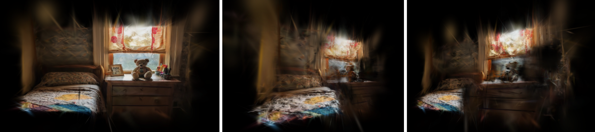
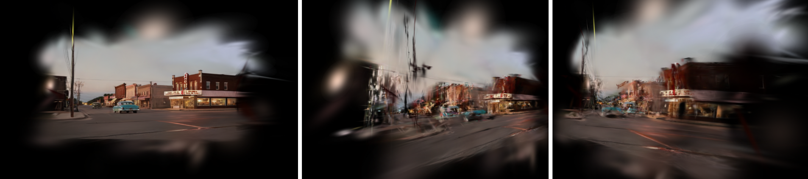
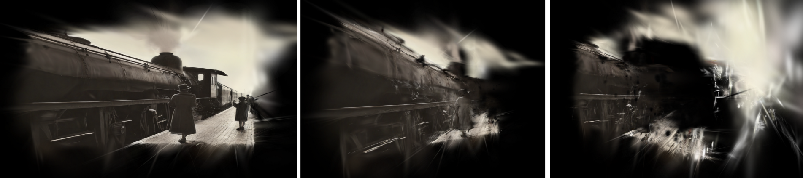
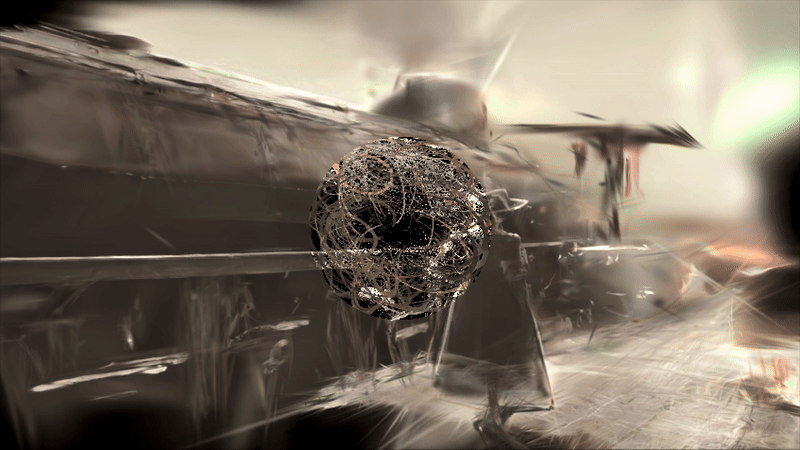

# Gaussian Splatting for Single Photo Input

This repository is part of a research collaboration between Domestic Data Streamers and the USC Mobile & Environmental Media Lab under the USC School of Cinematic Arts. It was shown in 2024 Flux Festival in Los Angeles. Originally, this project aimed to create navigable, immersive spaces for synthetic memories, specifically designed for therapeutic use by individuals with dementia. 

This repository is a fork of the [3D Gaussian Splatting for Real-Time Radiance Field Rendering](https://github.com/graphdeco-inria/gaussian-splatting). While Gaussian Splatting was initially developed for efficient, photorealistic 3D space reconstruction, its representation of Gaussians has been found to evoke an abstract, dream-like quality, making it well-suited for memory resonance and recreation in VR space. Inspired by [Gaussian Painters](https://github.com/ReshotAI/gaussian-painters), 3D Gaussians can be trained using single image by customizing the sparse dataset. This implementation also leverages the [Marigold model](https://github.com/prs-eth/Marigold) to estimate the depth of the input.

## Examples
Here are three results of their front view, left view, and right view respectively. The ply files can be found under the examples folder. All images were generated by AI.





## Setup

The code has been tested with the following environment:
- **Python 3.8**
- **PyTorch 2.4.1**
- **CUDA 12.4**
- **Visual Studio 2019**
- **Windows 11**

Follow these steps to set up the environment:
```bash
conda create --name gaussian_photo python=3.8
conda activate gaussian_photo

pip install -r requirements.txt
pip install submodules/diff-gaussian-rasterization
pip install submodules/simple-knn
pip install submodules/fused-ssim
```

### Modifications

The total number of training iterations has been reduced to 7000, as fitting a single image input requires less time compared to a full dataset.

## Running

To prepare the data, create a folder to store your image, e.g., data/example/image.png, and process the image with the following command:

```bash
python process_image.py --img_path <path to your image>
```
<details>
<summary><span style="font-weight: bold;">Command Line Arguments for process_image.py</span></summary>

  #### --img_path
  Path to the source image.
  #### --depth_path *(optional)*
  Path to the depth map of the source image, if a custom one is available.
  #### --resize_size *(default: 600)*
  Resizes the image to have its longer side match the specified pixel length.
  #### --depth_scale *(default: 1.0)*
  Scales the depth of the image. Note: Setting this value too high may lead to collapse.
  #### --grid_size *(default: 20)*
  Divides the image into grids for point cloud assignment, reducing resolution for an abstract effect. This value should not exceed the shorter side's pixel count.
</details>


Then, simply run:

```bash
python train.py -s <path to the directory of your image>
```

<br>

## Visualization
For simplicity, it is recommended to test with a [Three.js renderer](https://github.com/mkkellogg/GaussianSplats3D).

#### Some shader animations (to be published)





